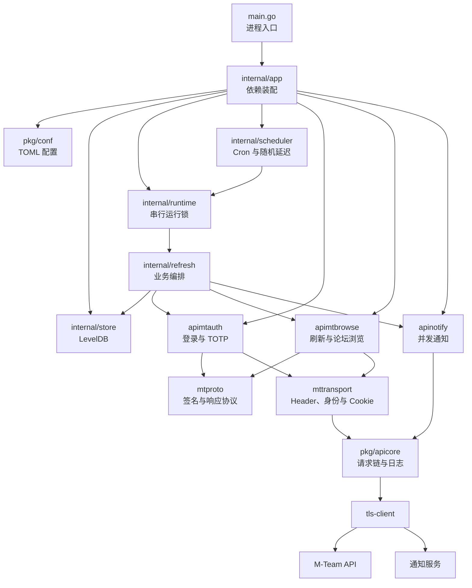
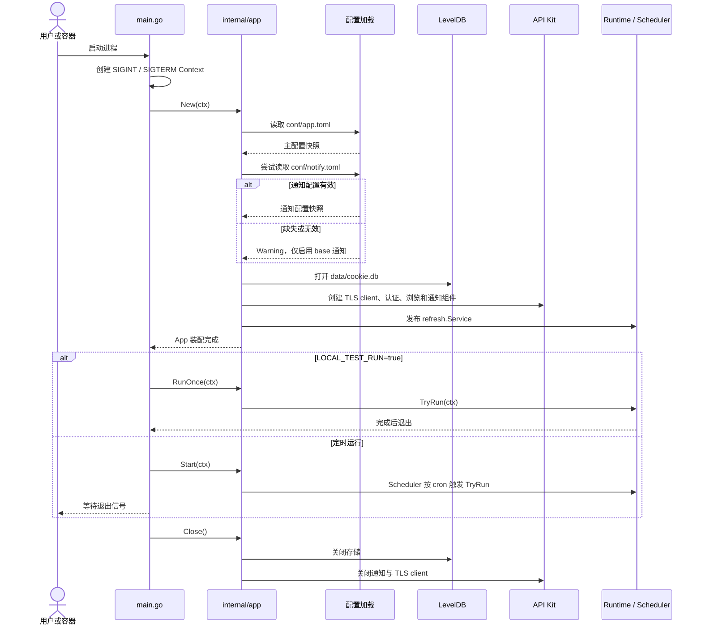
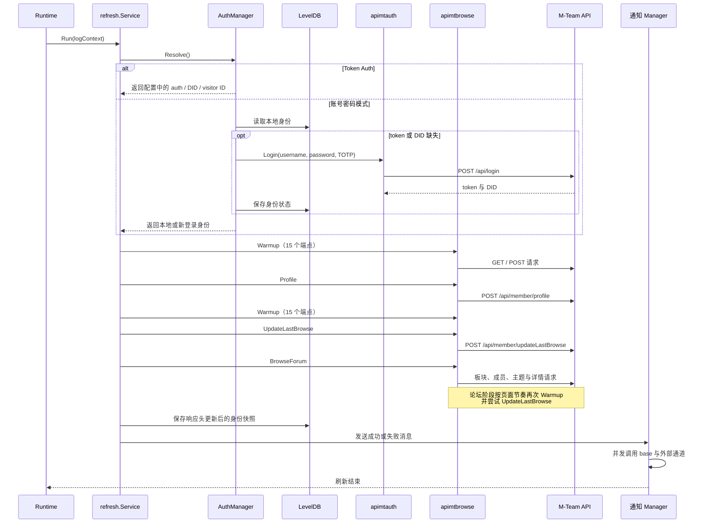

# M-Team 账号保活

`mtlogin` 是一个定时刷新 M-Team 登录状态的 Go 程序。它支持账号密码和 Token Auth 两种认证方式，可模拟页面预热与论坛浏览，并通过多种通知通道报告刷新结果。

## 核心能力

| 能力 | 说明 |
| --- | --- |
| 定时刷新 | 使用 cron 表达式调度，并支持触发后的随机延迟 |
| 双认证模式 | 支持账号密码登录、TOTP 和 Token Auth |
| 浏览器行为模拟 | 执行 Warmup、Profile、UpdateLastBrowse 和论坛浏览 |
| 身份状态持久化 | 账号密码模式使用 LevelDB 保存 token、DID 和 visitor ID |
| 多通道通知 | 支持 QQPUSH、企业微信、钉钉、Telegram、飞书和 Ntfy |
| 链路日志 | 应用日志、错误日志、HTTP 日志和通知日志使用同一 `logid` 串联 |

## 快速导航

- [快速开始](#快速开始)
- [选择认证方式](#选择认证方式)
- [Docker 运行](#docker-运行)
- [运行目录](#运行目录)
- [系统架构](#系统架构)
- [启动流程](#启动流程)
- [刷新流程](#刷新流程)
- [错误处理](#错误处理)
- [日志与排错](#日志与排错)
- [开发与验证](#开发与验证)
- [完整配置说明](conf/README.md)

## 快速开始

### 1. 准备环境

本地构建需要 Go 1.25 或更高版本。所有命令都应在仓库根目录执行，因为程序使用固定的相对路径读取 `conf/`、`data/` 和 `logs/`。

### 2. 创建配置文件

```bash
cp conf/app.toml.tpl conf/app.toml
cp conf/notify.toml.tpl conf/notify.toml
```

编辑 `conf/app.toml`，至少配置一种认证方式。通知是可选能力；即使所有外部通道都关闭，base 通知仍会写入 `logs/notify.log`。

详细字段说明见 [配置文件指南](conf/README.md)。

### 3. 构建程序

```bash
go build -o mtlogin .
```

仓库根目录的 `main.go` 是唯一程序入口，不需要移动到 `cmd/` 目录。

### 4. 单次验证

首次配置后，建议先执行一次完整刷新并退出：

```bash
LOCAL_TEST_RUN=true ./mtlogin
```

退出码为 `0` 表示本次运行满足业务成功条件。随后检查 `logs/app.log`、`logs/app.logging.wf` 和 `logs/notify.log`，确认没有需要处理的配置或认证错误。

### 5. 启动定时任务

```bash
./mtlogin
```

程序会根据 `conf/app.toml` 中的 `[app].crontab` 定时执行。修改配置后必须重启进程。

## 选择认证方式

| 对比项 | 账号密码模式 | Token Auth 模式 |
| --- | --- | --- |
| 配置位置 | `[mt.password_auth]` | `[mt.token_auth]` |
| 必填字段 | `username`、`password` | `auth`、`did`、`visitor_id` |
| TOTP | 支持 `totp_secret` | 不适用 |
| 身份来源 | 优先读取本地 LevelDB，缺失时自动登录 | 始终读取配置文件 |
| 身份持久化 | 写入 `data/cookie.db` | 不写入 LevelDB |
| 过期处理 | 清理本地身份；可配置本次立即重新登录 | 通知用户重新抓取配置，不自动回退 |
| 两种模式同时配置 | 不生效 | Token Auth 优先 |

账号密码模式适合长期无人值守运行。Token Auth 模式不需要保存密码，但认证信息过期后需要手动更新 `conf/app.toml` 并重启程序。

## Docker 运行

容器内固定使用以下目录：

- `/app/conf`：配置文件
- `/app/data`：LevelDB 身份状态
- `/app/logs`：运行日志

先在宿主机准备好 `app.toml` 和 `notify.toml`，再启动容器：

```bash
docker run -d \
  --name=mtlogin \
  -v /yourpath/conf:/app/conf \
  -v /yourpath/data:/app/data \
  -v /yourpath/logs:/app/logs \
  ghcr.io/scjtqs2/mtlogin:edge
```

镜像只包含 `app.toml.tpl` 和 `notify.toml.tpl` 模板。挂载空的宿主机 `conf` 目录会遮盖镜像内模板，因此应在启动前完成配置初始化。

## 运行目录

| 路径 | 作用 | 是否需要持久化 |
| --- | --- | --- |
| `conf/app.toml` | 调度、刷新和 M-Team 配置 | 是 |
| `conf/notify.toml` | 外部通知通道配置 | 建议 |
| `data/cookie.db` | 账号密码模式的 LevelDB 身份状态 | 是 |
| `logs/app.log` | 全量应用日志 | 建议 |
| `logs/app.logging.wf` | Warning 及以上日志 | 建议 |
| `logs/http.log` | 脱敏后的下游 HTTP 请求日志 | 建议 |
| `logs/notify.log` | base 通知日志 | 建议 |

真实配置文件不会提交到 Git，也不会打入 Docker 镜像。

## 系统架构

`internal/app` 是唯一依赖装配层。配置、存储、运行时、调度、刷新服务和 API Kit 都在启动时构建一次，运行期间不重新加载配置。



### 模块边界

| 模块 | 职责 |
| --- | --- |
| `internal/app` | 加载配置并装配所有依赖，负责资源关闭 |
| `internal/scheduler` | 解析 cron、等待随机延迟、触发运行 |
| `internal/runtime` | 保证同一时间最多执行一个刷新任务 |
| `internal/refresh` | 认证、刷新、状态持久化和通知的业务编排 |
| `internal/store` | 保存账号、token、DID、visitor ID 和身份 epoch |
| `pkg/apikit/apimtauth` | 登录、TOTP 和认证响应处理 |
| `pkg/apikit/apimtbrowse` | Warmup、Profile、UpdateLastBrowse 和论坛浏览 |
| `pkg/apikit/apinotify` | 组装并并发调用所有已启用通知通道 |
| `pkg/apicore` | TLS client、代理、请求头和脱敏 HTTP 日志 |

认证与浏览共用同一个 TLS client 和 `mteam` Cookie scope。通知请求不使用该 Cookie scope，因此不会共享 M-Team 登录态。

## 启动流程



主配置加载失败会直接终止启动。通知配置加载失败只会记录 Warning，base 通知仍然可用。

## 刷新流程

每次刷新使用唯一 `logid`。业务请求受 `[refresh].timeout` 控制，通知使用独立 Context，不会因为业务超时而直接取消。



刷新主链路顺序如下：

1. 解析认证方式并获取身份。
2. 执行第 1 轮 Warmup，共 15 个固定端点。
3. 获取 Profile，包括上传量、下载量、魔力值和刷新前的上次访问时间。
4. 执行第 2 轮 Warmup。
5. 调用 UpdateLastBrowse。
6. 模拟论坛首页、随机板块和随机主题浏览。
7. 持久化更新后的身份快照，并发送通知。

只要主链路或论坛阶段任意一次 UpdateLastBrowse 成功，本次保活就满足成功条件。论坛阶段的普通业务错误按 best effort 处理；认证失败、Context 取消和超时仍会向上返回。

### 请求协议

- Warmup 和 UpdateLastBrowse 的 POST 请求使用 `multipart/form-data`。
- 论坛的 `/api/member/bases`、`/api/forum/topic/search` 和 `/api/forum/topic/detail` 使用 JSON。
- 所有签名请求都包含 `_timestamp` 和 `_sgin`。
- `_sgin` 使用 `method&path&13 位毫秒时间戳` 执行 HMAC-SHA1 后再 Base64 编码。
- `/ping` 返回纯文本 `pong`，只校验 HTTP 状态；其他 M-Team API 严格解析 `{code, message, data}`。
- 响应头中的 `Did` 或 `did` 会更新当前 Session 的 DID。

## 错误处理

### 主要策略

| 场景 | 处理方式 |
| --- | --- |
| `conf/app.toml` 缺失、解析失败或无效 | 启动失败并退出 |
| `conf/notify.toml` 缺失或无效 | 记录 Warning，仅启用 base 通知 |
| 账号密码模式认证过期 | 清空本地身份，根据配置决定立即重登或下次重登 |
| Token Auth 认证过期 | 每次失败都通知用户更新配置，不回退到账号密码 |
| 上一次刷新仍在运行 | 跳过本次调度，避免并发刷新 |
| 单个通知通道失败 | 不阻断其他通道，最终聚合错误并记录 Warning |
| 论坛阶段普通业务错误 | 记录 Warning，保留已经取得的刷新结果 |

### 错误码

| 码段 | 业务线 | 示例 |
| --- | --- | --- |
| `100xxx` | 配置 | `100000` 读取失败，`100002` 配置无效 |
| `200xxx` | M-Team 请求 | `200000` 认证失败，`200004` 需要 TOTP |
| `400xxx` | 刷新 | `400000` 身份状态已变更 |
| `500xxx` | 调度与运行时 | `500000` 刷新任务正在运行 |

通知只展示稳定的公开错误码和说明。完整 Cause 和脱敏后的下游响应只进入日志。

## 日志与排错

### 日志文件

| 文件 | 内容 |
| --- | --- |
| `logs/app.log` | Debug、Info、Warning 和 Error 应用日志 |
| `logs/app.logging.wf` | Warning 及以上日志，适合快速发现异常 |
| `logs/http.log` | M-Team 与通知服务的脱敏 HTTP 请求日志 |
| `logs/notify.log` | base 通知内容，可用于确认最终业务结果 |

常见敏感 Header、URL 参数和 Body 字段会替换为 `[REDACTED]`。日志仍可能包含账号名、业务数据或论坛内容，应限制文件访问权限。

### 使用 `logid` 定位完整链路

先从应用日志找到最近一次刷新：

```bash
rg 'refresh: Run started' logs/app.log
```

取得 `logid` 后，在所有日志中检索同一链路：

```bash
rg 'logid\[<LOGID>\]' \
  logs/app.log \
  logs/app.logging.wf \
  logs/http.log \
  logs/notify.log
```

建议按以下顺序判断：

1. `app.log` 是否进入刷新和论坛阶段。
2. `http.log` 是否存在非 `200` 状态、传输错误或非 `0` 业务码。
3. `app.logging.wf` 中的 Warning 是否属于 best effort 阶段。
4. `notify.log` 是否记录“账号刷新成功”或明确失败原因。

### 常见问题

| 现象 | 检查项 |
| --- | --- |
| 启动时报配置错误 | 检查固定路径、TOML 语法、未知字段和必填项 |
| 修改配置后没有生效 | 重启进程；配置只在启动时加载一次 |
| Token Auth 每次都认证失败 | 重新抓取 `auth`、`did`、`visitor_id` 并重启 |
| Docker 启动后找不到配置 | 确认宿主机 `conf` 目录已包含实际 TOML 文件 |
| 论坛阶段 UpdateLastBrowse 返回 `code=1` | 若主链路已成功且最终成功通知存在，该 Warning 不影响本次保活结果 |
| 通知未收到 | 检查 `logs/notify.log`、通道 `enabled` 和必填字段 |

## 配置说明

配置分为两个文件：

- `conf/app.toml`：调度、刷新、代理和 M-Team 认证。
- `conf/notify.toml`：通知全局超时和各通道配置。

字段、默认值、最小配置和排错方法见 [conf/README.md](conf/README.md)。

## 开发与验证

```bash
# 运行全部测试
go test ./...

# 构建全部包
go build ./...

# 静态检查
go vet ./...

# 使用真实配置单次运行
LOCAL_TEST_RUN=true go run .
```

架构依赖边界由 `internal/app/dependency_test.go`、全量测试和代码审查共同维护。项目不单独设置 `internal/architecture` 包。

